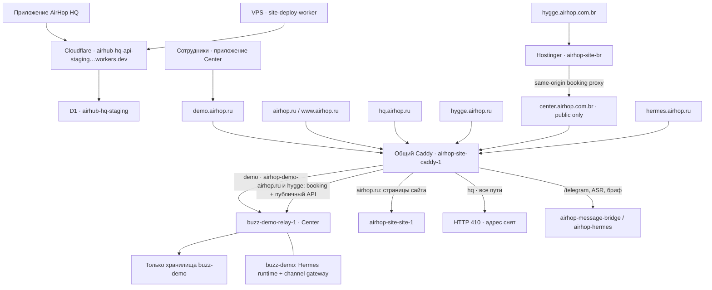

# AirHop: продукты, окружения и границы выкладки

Основной VPS проверен чтением **2026-09-12**, Hostinger VPS для сайта Бразилии —
**2026-09-14**. Это каноническая карта инфраструктуры
для разработчиков и агентов Center, HQ и Site. Название каталога, Docker-образа
или старый README не определяет продукт и не даёт разрешения на выкладку.
Конфигурация целей: [`environments.json`](../deploy/airhop/environments.json).
Наблюдения: [`runtime-20260912.json`](deployment/runtime-20260912.json).
Снимок — свидетельство на указанное время, а не автоматически актуальный desired state.

**Текущее состояние:** действующий HQ находится в Cloudflare,
`airhub-hq-api-staging.airhub-hq-api.workers.dev`. Старый Docker-контур
`buzz-prod` удалён 2026-09-12 после проверенного приватного архива.
`hq.airhop.ru` возвращает HTTP 410; Caddy и ресурсы демо сохранены.
[Архив, точный состав удаления и проверки](AIRHOP_LEGACY_RETIREMENT_20260912.md),
[финальный snapshot](deployment/runtime-20260912-after-retirement.json),
[доказательства адреса HQ](AIRHOP_HQ_DOMAIN_AUDIT_20260912.md).

## 1. Три продукта и техническое наследие

| Продукт | Репозиторий рядом с Center | Ответственность |
| --- | --- | --- |
| AirHop Center | `airhop-center` | Приложение сотрудников, состав команды и приглашения, Booking Core, данные центра, публичная форма записи |
| AirHop HQ | `airhop-hq` | Внутренняя работа команды AirHop: организации, материалы, агенты, релизы и подключения Center; собственная продуктовая спецификация в `docs/AIRHUB_HQ_SOURCE_OF_TRUTH.md` |
| AirHop Site | `airhop-site` | Публичный сайт AirHop, бриф и публичные страницы; обращения к публичному API Center |

В разговоре встречались варианты «AskYou» и «HU». Для технических целей
использовать точные имена **Center**, **HQ**, **Site** и target из реестра.
Не создавать новые цели или связи на основании расшифровки речи.

Buzz/BAS — унаследованная кодовая база и имена компонентов. Раздел `Ecosystem`
старой инструкции описывает upstream Buzz/Block, **не** карту развёртываний
AirHop. `buzz-prod` — исторический идентификатор Compose, а не обозначение
«production любого текущего продукта». Переименование работающих проектов,
томов и каталогов не входит в исправление документации: оно требует отдельной
миграции с проверкой данных.

Список сотрудников и приглашения принадлежат **Center**. Исправление этого
экрана не требует выкладки HQ или смены его аккаунтов. Серверный web bundle и
нативное приложение Center выпускаются отдельно: обновление публичной страницы
приглашения не обновляет уже установленное приложение сотрудников.

## 2. Что действительно работает на сервере

Хост `46.173.25.23`, hostname `airhop-prod`, Docker daemon ID
`dbfb14a9-8404-4f21-ad3e-3481b173ea9a`. Слово `prod` в hostname не делает
все размещённые здесь окружения production.

| Цель | Домен | Compose / процесс | Фактическое назначение |
| --- | --- | --- | --- |
| `center-demo` | `demo.airhop.ru` | `buzz-demo`, relay `buzz-demo-relay-1` | Демо Center; сюда относятся согласованные проверки сотрудников |
| `center-demo-br-public` | `center.airhop.com.br` | общий Caddy `airhop-site-caddy-1` → `buzz-demo-relay-1` | Только публичная запись и точный allowlist public API для изолированного tenant Hygge Brasil; staff/admin/operator/pairing/WebSocket не опубликованы |
| `hq-api` | `airhub-hq-api-staging.airhub-hq-api.workers.dev` | Cloudflare Worker + D1; вне этого VPS | Действующий API установленного AirHop HQ и worker публикации сайтов |
| `hq-legacy-relay` | `hq.airhop.ru` | Старый `buzz-prod` удалён | HTTP 410 в общем Caddy; данные в закрытом архиве |
| `site` | `airhop.ru`, `www.airhop.ru` | `airhop-site`, приложение `airhop-site-site-1` | Сайт; `www` перенаправляется на основной домен |
| Общий HTTPS-вход | Все домены в схеме ниже | `airhop-site-caddy-1` | Общий прокси физически находится в Compose Site; имеет межпродуктовое влияние |
| Бриф / сообщения | `hermes.airhop.ru` | `airhop-hermes`, `airhop-message-bridge` | Отдельные host-network службы; не путать с Hermes демо Center |
| Публикация сайтов | Не установлен отдельный публичный домен | systemd `airhop-site-deploy-worker.service` | `/opt/airhop/site-deploy-worker`; не является relay или HQ API |

Standalone HQ API работает в Cloudflare Workers с D1 `airhub-hq-staging`,
что подтверждено встроенным frontend установленного приложения, конфигурацией
deploy worker и публичным readiness API. Он не входит в Docker/systemd этого
хоста. Региональные серверы, включая WhatsApp edge,
не обследованы этой инвентаризацией и не являются целями текущей выкладки.

### Отдельный Hostinger VPS: сайт Бразилии

`site-br-production` находится не на описанном выше VPS, а на Hostinger
`root@187.124.129.75`: hostname `srv1610606`, Docker daemon ID
`ecd7ebd1-362b-4a1a-86bb-69dd3cb138eb`. Зарегистрированная цель:

| Цель | Домены | Compose / процесс | Данные и связи |
| --- | --- | --- | --- |
| `site-br-production` | `airhop.com.br`, `www.airhop.com.br`, preview `airhop-br.srv1610606.hstgr.cloud`, локализованный пример `hygge.airhop.com.br` | `airhop-site-br`, контейнер `airhop-site-br-site-1`, общий Traefik `traefik-mp4t-traefik-1` | `/opt/airhop-site-br/data`; форма использует durable outbox и действующий Cloudflare HQ API; Hygge проксирует только public booking surface в `center.airhop.com.br` |

Источник — репозиторий `airhop-site`, deployment-файлы —
`deploy/hostinger/airhop-br-site`. Релизы находятся в
`/opt/airhop-site-br/releases`, приватная конфигурация —
`/opt/airhop-site-br/runtime.env`, общий lock этой цели —
`/opt/airhop-infra/deploy.lock`, сеть — `airhop-site-br-edge`.

На снимке 2026-09-14 контейнер здоров на образе
`airhop-site-br:airhop-br-20260914-e2c752b-hygge-center`, image ID
`sha256:700c3401bc124c1f60bc23b7c03535fc2f93dac4e0c52ae0e56c8ec38bbd30de`.
Публичный сайт намеренно остаётся `noindex` до подтверждения обязательных
бизнес-, юридических и privacy-фактов; это не означает, что Hostinger является
preview-платформой. ChatGPT Sites не является production target или runtime
dependency этой цели.



На `hygge.airhop.ru` главная и ресурсы сайта обслуживаются из
`/opt/airhop/demo-test/hygge-performance-v1`; разрешённый публичный API, форма
и короткие ссылки направляются в demo. Staff/admin/WebSocket там не публикуются.
На `demo.airhop.ru` `/pair` идёт в demo pairing, `/webhooks/whatsapp/*` — в
demo channel gateway. На старом `hq.airhop.ru` все пути, включая `/pair`, отвечают 410.
Временный `airhop.46-173-25-23.sslip.io` публикует один connection-scoped
WhatsApp webhook; это дополнительный вход в демо, не ещё один Center.

На `center.airhop.com.br` общий Caddy публикует только `/booking`,
`/booking/manage/<token>`, `/booking-assets/*`, `robots.txt` и точный allowlist
`/api/airhop/public/v1/*`. Корень и staff/admin/operator/pairing/WebSocket
возвращают 404. Host используется отдельным tenant: community
`b6a10b42-7c2c-4b7f-8e3b-9c4251500001`, organization
`b6a10b42-7c2c-4b7f-8e3b-9c4251500002`, locale `pt-BR`, timezone
`America/Sao_Paulo`, currency `BRL`. Активация `hygge-br-center-a52e478`
сохранена под `/opt/airhop/buzz-demo/releases`; backup —
`/opt/airhop/backups/hygge-br-center-a52e478`.
Маршруты `airhop.ru/deployment-pilot/` и `/deployment-whatsapp-e2e/` обслуживают
статические pilot-артефакты из `/var/www/airhop-hq-*`. Наличие `hq` в имени
каталога этих артефактов не превращает их в запущенный standalone HQ API.

## 3. Конфигурация, сети и данные

Столбец legacy ниже — **историческая привязка для чтения архива**. Все перечисленные
legacy-контейнеры, тома и отдельная сеть удалены; `/opt/airhop/buzz-hq` и runtime
override перенесены в закрытый архив. Не использовать эти пути для выкладки.

| Ресурс | Center demo | Legacy HQ relay |
| --- | --- | --- |
| Base Compose | `/opt/airhop/buzz-demo/source/deploy/compose/compose.yml` | `/opt/airhop/buzz-hq/source/deploy/compose/compose.yml` |
| Файл секретов (не выводить содержимое) | `/opt/airhop/buzz-demo/source/deploy/compose/.env` | `/opt/airhop/buzz-hq/source/deploy/compose/.env` |
| Host override | `/opt/airhop/buzz-demo/buzz-demo.override.yml` | `/opt/airhop/buzz-hq/buzz-hq.override.yml` содержал routing aliases и восстановленные тома |
| Закрытая сеть | `buzz-demo_buzz-net` | `buzz-prod_buzz-net` |
| PostgreSQL volume | `buzz-demo-postgres-data` | `buzz-prod_buzz-postgres-data` |
| Redis volume | `buzz-demo-redis-data` | `buzz-hq-redis-restored-20260806` |
| MinIO volume | `buzz-demo-minio-data` | `buzz-hq-minio-restored-20260806-v2` |
| Git volume | `buzz-demo-git-data` | `buzz-prod_buzz-git-data` по HQ override; ошибочный relay ранее монтировал demo Git volume; том demo сохранён |

Ранее оба контура подключались к общей `airhop-web` через разные псевдонимы.
Теперь действующий demo использует `airhop-demo-relay`; legacy alias `airhop-hq-relay` удалён. Общая сеть используется для входного
прокси; это не разрешение делить БД, секреты или тома. Общий короткий alias
`relay` на этой сети не использовать для маршрутизации продуктов.

Site: Compose-файлы `/opt/airhop/site/source/deploy/beget/site/compose.yml` и
`public-hosts.override.yml`; данные приложения `/opt/airhop/site/data`.
Caddyfile расположен в том же каталоге `deploy/beget/site/`.

**Исторический drift удалённого HQ:** `/opt/airhop/runtime/deploy/buzz-hq.override.yml`
использовался частью старых контейнеров, но отличался от
`/opt/airhop/buzz-hq/buzz-hq.override.yml`: отсутствуют proxy aliases, MinIO
указывает на `buzz-prod_buzz-minio-data` вместо фактически работающего
восстановленного тома. Оба файла сохранены как история. Пересоздавать
удалённый стек по ним нельзя; действующий HQ от них не зависит.

Center demo накопил длинную цепочку release overlays (полная последовательность
есть в снимке). Её нельзя сокращать до base + host, выбирать последний файл по
дате или копировать из старого runbook. Взять порядок из меток **здорового demo
relay**, проверить входные файлы и результат `config`, сохранить их хеши.
У ошибочно пересозданного legacy relay метки содержали чужую demo-цепочку;
они сохранены как свидетельство ошибки, а не шаблон восстановления.

При диагностике обнаружено несовпадение demo service config hash:
метка запущенного relay `589324aa1c0662753f4d8ea4a21d7bfbae2dff4df0f8dfe25ba43b247be142a7`,
результат `docker compose config --hash relay`
`f68db2a1194f438375735585fb16d66de1bc10a3fb7922881a56b494936e2faf`.
Сверенные environment, entrypoint, mounts, networks и release labels совпали.
Дополнительный `docker compose --dry-run up --no-deps --no-build --pull never`
для **текущей** цепочки выдал только `buzz-demo-relay-1 Running`, без операций
пересоздания. Поэтому сравнение `config --hash` с runtime label здесь не служит
доказательством drift. Guard использует решение самого Compose о неизменности
текущего relay, дополнительно сверяет live-поля и сохраняет хеши полных входов
и итоговых конфигураций в план. Если dry-run предлагает изменение или его
формат вывода неизвестен, подготовка останавливается. Проверено на Compose
2.40.3; точная внутренняя причина различия двух хешей не установлена.

## 4. Обязательный порядок работы

1. Прочитать эту карту и продуктовый источник истины соответствующего repo.
   Назвать конкретную цель: например, `center-demo`, а не «сервер», «БАЗ» или
   «прод». Неизвестный target сначала обследовать и внести в реестр.
2. Снять актуальную инвентаризацию без секретов. Сверить Docker daemon, проект,
   домен, container ID, image ID, сеть, тома и всю Compose-цепочку. Несовпадение
   означает остановку изменений и разбор причины, а не подгонку проверки.
3. Подготовить изолированный релиз из точного предшественника с проверенным
   diff. Сохранить source commit/archive hash, image ID, состав релиза и тесты.
   Чужие незакоммиченные изменения не перезаписывать и не включать молча.
4. Все изменяющие Compose-команды, включая rollback, выполняются с явным
   `--project-name`. Во время применения удерживать общий для этой цели lock
   `/opt/airhop/buzz-demo/deploy.lock` и повторять сравнение предшественника под
   lock. Заблокированное окружение не обходить другим lock-файлом.
5. Обновлять только согласованные сервисы. Для одного relay использовать
   `--no-deps`, фиксированные образы, запрет pull/build в момент переключения.
   Не выполнять `down`, `down -v`, `--remove-orphans`, очистку Docker или
   массовое `up` ради изменения интерфейса. Caddy — отдельная общая зависимость.
6. Проверить image ID, здоровье, публичный пользовательский маршрут, неизменность
   соседних контейнеров. Сохранить результаты и место backup. Для изменения
   БД заранее подготовить проверенный backup/restore и отдельный план миграции.
   Откат образа не равен откату БД.
7. Обновить карту, если изменилась топология; обновить release record, если
   поменялся только образ. Старый снимок не переписывать как будто его не было.

Полные `docker inspect` и `docker compose config` могут содержать секреты.
Не публиковать их в чат, репозиторий или общие логи. Для инвентаризации:

```bash
ssh root@46.173.25.23 python3 - < scripts/airhop-runtime-audit.py > /private/tmp/airhop-runtime.json
```

## 5. Проверяемый вход для узкого релиза demo relay

[`airhop-demo-release.py`](../scripts/airhop-demo-release.py) предназначен
только для замены образа и release labels demo relay. На зарегистрированном
сервере, из проверенной копии Center repo:

```bash
python3 scripts/airhop-demo-release.py plan \
  --release-file /absolute/path/to/release/rollout.compose.yml \
  --out /private/path/unique-release-plan.json
# После review и в рамках согласованной выкладки:
python3 scripts/airhop-demo-release.py apply /private/path/unique-release-plan.json
```

`plan` не меняет контейнеры. `apply` удерживает demo lock, повторно проверяет
весь план, ID контейнера/образа, хеши входов и соседей, задаёт `buzz-demo` явно.
Чужой daemon/project/hostname/network/volume, изменение других сервисов,
секретов или routing labels останавливает релиз. План не перезаписывается.
Guard проверяет deployment-конфигурацию, но не доказывает безопасность кода
внутри образа: diff/Dockerfile, тесты и необходимость миграций проверяются при
review кандидата до применения. Смена backend с миграциями сюда не относится.
Legacy-контур помечен `removed`: проверяется отсутствие его контейнеров,
Compose-проекта, томов, отдельной сети и proxy aliases. Повторное появление
останавливает релиз для разбора; автоматически удалять или поднимать его нельзя.
После ошибки применения скрипт останавливается: автоматический откат без
проверки состояния и миграций намеренно не выполняется. Предыдущая полная
Compose-цепочка и image ID сохранены в плане для отдельно проверенного отката.

Это не общий deployer для HQ, Site, Hermes или миграций. Такие изменения
требуют отдельного reviewed runbook с теми же проверками и блокировкой.
Прямой доступ root/Docker позволяет обойти скрипт: документ и guard не являются
изоляцией прав. Для принудительной защиты нужен отдельный инфраструктурный
этап: доступ к выкладке через ограниченный runner, единый lock у всех entrypoints
и аудит операций. До него нельзя обещать невозможность перезаписи.

## 6. Инцидент 2026-09-12: история и снятие legacy с эксплуатации

Скрипт `/opt/airhop/staff-invite-bae27a94b9a0/deploy.sh` вызвал Compose с
demo-файлами, но без `--project-name buzz-demo`. Base задаёт `name: buzz-prod`.
В результате пересоздан `buzz-prod-relay-1`, смонтирован demo Git volume и
потерян HQ proxy alias. Тот же дефект был в функции rollback.

**Повторный запуск заблокирован на сервере:** под demo lock исходный скрипт
сохранён как `deploy.sh.incident-20260912.original` (доступ 0600), а `deploy.sh`
заменён остановкой с объяснением и `exit 1`. Проверка нового входа подтвердила
отказ без вызова Docker. SHA-256 сохранённого оригинала:
`d88467ada06dae31d4b4e9560cf4437bec2fc5a47d5f118b0ef01cf1db00c45f`.
Не запускать сохранённый оригинал и не восстанавливать его как deployment entrypoint.

На момент первоначального снимка demo relay здоров и остаётся на
`airhub-center-relay:whatsapp-credential-rotation-df472bd`; Site здоров.
Legacy HQ relay тогда перезапускался с ошибочным
`airhub-center-relay:staff-invite-bae27a94b9a0`. Прежний образ по записи
инцидента — `airhub-center-relay:3e36b1c`; это ещё не достаточная спецификация
восстановления без правильного routing override. Состояние/целостность данных
не проверены этим аудитом; отсутствие изменений БД не заявляется.

Восстановление legacy relay ранее заблокировала автоматическая проверка
разрешений из-за отсутствия явного согласования изменения этого контура.
После проверки установленного приложения выяснилось, что восстанавливать
legacy relay для HQ не требуется: реальный HQ работает в Cloudflare.
Relay сначала был остановлен в карантин, затем весь legacy-контур удалён
после проверенного архива. Состав и доказательства приведены в
[отчёте удаления](AIRHOP_LEGACY_RETIREMENT_20260912.md).
Выкладка исправлений сотрудников остаётся отдельной задачей.

Исторические команды восстановления `buzz-prod` исключены из действующей карты:
их пути сняты с эксплуатации. Архив не является разрешением возрождать сервис.

Guard проверен 22 regression tests, включая повторное появление старых контейнеров,
томов, сети, Compose-проекта или alias, сохранность demo/shared ресурсов и отказ
до изменения релиза. Текущий legacy lifecycle — `removed`; guard требует отсутствия
старых ресурсов. При неожиданном ресурсе он останавливает релиз для разбора.
Проверки включены в `.github/workflows/ci.yml`. Релиз приложения Center в рамках
удаления legacy не применялся.

Следующие инфраструктурные работы: обследовать остальные хосты, подготовить
устранить drift действующих конфигураций, свернуть demo overlays с доказанным
равенством итогового config, внедрить ограниченный deploy runner. Всё это
сохраняет действующие данные и требует отдельных проверенных изменений.
