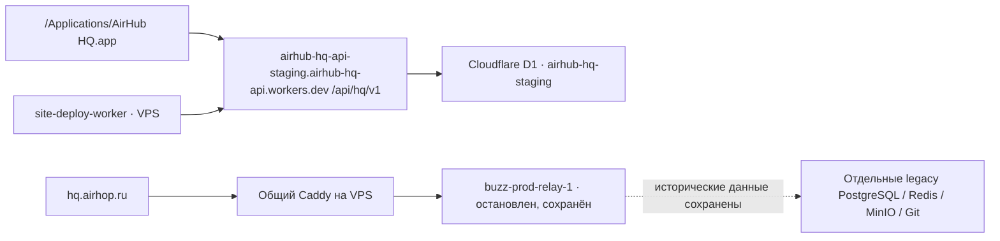

# AirHop HQ и hq.airhop.ru: проверка фактической связи

> Итоговое состояние: описанный ниже карантин был промежуточным. В 21:21 UTC
> старый контур удалён после проверенного архива; домен отвечает HTTP 410.
> См. [отчёт удаления](AIRHOP_LEGACY_RETIREMENT_20260912.md). Ниже сохранены
> исходные доказательства и последовательность проверки.

Дата: 2026-09-12. Результат: **установленный AirHop HQ использует Cloudflare
Worker, а не старый Docker relay на `hq.airhop.ru`. Восстанавливать этот relay
ради работоспособности текущего HQ не требуется.**

## Проверенные цепочки

`staging` — фактическое историческое имя работающего HQ endpoint. Его нельзя
считать одноразовым тестом и удалять из-за названия: установленное приложение
и серверный worker используют его сейчас. Переименование/перенос endpoint
не входили в эту проверку.

## Доказательства

| Проверка | Факт |
| --- | --- |
| Установленное приложение | `/Applications/AirHub HQ.app`, bundle ID `app.airhop.hq.local`, версия `0.5.4`, executable `buzz-desktop` |
| Источник API в установленном frontend | `VITE_AIRHOP_HQ_URL: https://airhub-hq-api-staging.airhub-hq-api.workers.dev` |
| Старый домен в установленном frontend | `hq.airhop.ru` отсутствует |
| Реальный HQ readiness | `GET /api/hq/v1/readiness`: `status: ready`, `database: ready`, `schemaVersion: 15` |
| Worker публикации сайтов | `/etc/airhop/site-deploy-worker.env`, `AIRHOP_HQ_URL` указывает на тот же Cloudflare endpoint |
| Backend source | `airhop-hq/services/hq-api/wrangler.jsonc`: Worker `airhub-hq-api`, env `staging`, база D1 `airhub-hq-staging` |
| Client source | `airhop-hq/desktop/src/features/airhop-hq/api/client.ts`: `getAirhopHqClient()` читает `VITE_AIRHOP_HQ_URL`, операции идут через `/api/hq/v1` |
| Старый домен | Caddy отправляет `hq.airhop.ru` в `airhop-hq-relay:3000`; `/pair` — в отдельный старый pairing relay. Это другой HTTP-протокол и процесс |

Проверена именно установленная сборка, а не только меняющийся исходный repo:
из Mach-O извлечён встроенный Brotli-ресурс frontend. В build-cache были и
старые варианты с `hq.airhop.ru`/localhost, но они не совпали с установленным
бинарным файлом; они не использованы как доказательство текущего endpoint.

- SHA-256 установленного binary:
  `ecc121521e73cf51015aa94a7d74622abc5031f319b3827edad2ac7b60b4ac9b`.
- Встроенный entry asset: `assets/index-fZ6hLmgt.js`.
- Brotli stream: offset `45312494`, длина `203194` байта; после распаковки
  `764003` байта.
- SHA-256 распакованного frontend:
  `089eb3217dc610ecdc8482140af0cc66c6dfc5b2089f8e0915a6dddeed124879`.

Readiness подтверждает доступность API и БД, а не полную приёмку всех экранов,
каналов и пользовательских операций HQ. В этой проверке не отправлялись
сообщения, не создавались организации и не менялся Worker/D1.

## Потребители и сохранённые данные legacy

- В проверенных URL-конфигурациях message bridge, brief manager и deploy worker
  нет зависимости от `hq.airhop.ru`. Bridge использует `airhop.ru`,
  `hermes.airhop.ru` и локальный ASR; deploy worker использует Cloudflare HQ.
- В проверенных runtime-исходниках этих служб и `site/source/app` не найдено
  ссылок на `hq.airhop.ru`, `airhop-hq-relay`, `buzz-prod`.
- В доступных Caddy logs за запрос `--since 48h` обнаружены только 6 вызовов
  `/health` и 2 `/` с 502 в интервале 20:01–20:42 UTC — совпадающие с текущими
  диагностическими запросами. `/api/hq/v1/*` не обнаружен. Ротация/границы
  доступных logs не позволяют доказать отсутствие любого исторического клиента.
- Legacy PostgreSQL: `496` событий, последнее `2026-09-05 18:26:22+00`;
  размер БД `19805875` байт; community host `hq.airhop.ru`.
- На момент проверки других client backend connections к legacy PostgreSQL
  не было. Содержимое переписок и персональные данные не читались.

Это достаточное основание исключить старый relay из зависимостей текущего HQ,
но **не основание безвозвратно удалять его историю**. Для окончательного
удаления нужен отдельный проверенный backup данных, решение об их хранении и
проверка прочих старых клиентов, pairing и домена. Snapshot контейнера ниже —
не backup базы данных.

## Выполненное действие

Под lock `/opt/airhop/buzz-hq/deploy.lock`:

1. Проверены точный ошибочный образ, Compose project и состояние `restarting`.
2. Сохранён приватный snapshot в
   `/opt/airhop/backups/legacy-hq-relay-quarantine-20260912T205006Z/relay-before.json`.
3. Только у `buzz-prod-relay-1` установлено `restart=no`, контейнер остановлен.
4. Подтверждены прежний container ID, состояние `exited` и отсутствие изменений
   ID/image/start time остальных контейнеров.

Контейнер не удалён; PostgreSQL, Redis, MinIO, Git volumes и pairing сохранены.
Caddy и DNS не изменены. Поэтому `hq.airhop.ru` пока продолжает отвечать 502:
это оставшийся маршрут к остановленному legacy relay, а не адрес действующего
Cloudflare HQ. Автоматически запускать сохранённый ошибочный образ нельзя.

После остановки подтверждены HTTP 200: фактический Cloudflare HQ readiness,
`demo.airhop.ru/health`, `airhop.ru/` и `hermes.airhop.ru/health`.
Новый [снимок контейнеров](deployment/runtime-20260912-after-quarantine.json)
сохранён отдельно от первоначального. 17 regression tests и повторный live
read-only preflight demo guard прошли; применение релиза не выполнялось.

В каноническом реестре теперь есть отдельная цель `hq-api` (Cloudflare), а
`hq-legacy-relay` помечен `quarantined` с точными container/image IDs.
Demo release guard сохраняет этот карантин и больше не требует поднимать
старый relay ради релиза Center. Остальные проверки проекта, конфигурации,
предшественника, lock и соседних контейнеров сохранены.

Раннее предположение в переписке «сломался сам HQ, сначала обязательно его
восстановить» было неверным. Повреждён старый relay; действующий HQ backend
находится в Cloudflare и этой Docker-выкладкой не изменялся.
